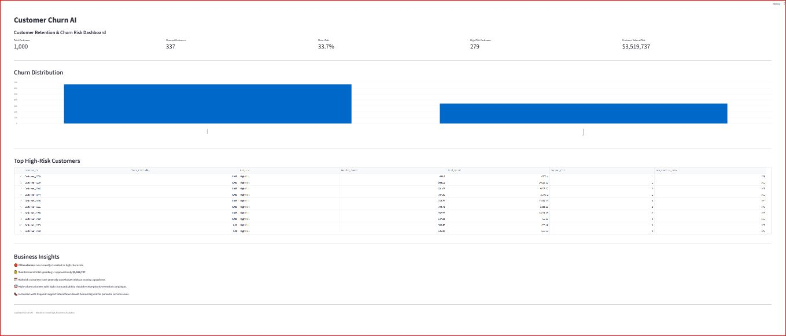

# Customer Churn AI

## Customer Retention & Churn Risk Analytics

Customer Churn AI is a machine learning and business analytics project that identifies customers at risk of leaving a business and provides actionable retention insights.

The project transforms customer data into:

* Customer churn analysis
* Churn prediction
* Customer risk classification
* High-risk customer identification
* Customer value-at-risk analysis
* Business retention recommendations
* Interactive Streamlit dashboard

---

## Dashboard Preview



---

## Business Problem

Customer churn can significantly affect business revenue and long-term customer relationships.

Businesses need to identify customers who are likely to leave before they become inactive.

This project uses customer behavior data and machine learning to identify high-risk customers and help businesses prioritize retention activities.

---

## Key Features

### Customer Analytics

The project analyzes:

* Customer demographics
* Customer tenure
* Monthly spending
* Total spending
* Number of orders
* Average order value
* Support interactions
* Days since last purchase
* Discount usage

### Churn Analysis

The project calculates:

* Total customers
* Active customers
* Churned customers
* Overall churn rate
* Customer behavior differences between active and churned customers

### Machine Learning

A Random Forest Classifier is used to predict customer churn.

The model generates:

* Churn prediction
* Churn probability
* Customer risk level

Risk levels are classified as:

* High Risk
* Medium Risk
* Low Risk

### High-Risk Customer Identification

The project identifies customers with high predicted churn probability and prioritizes them for potential retention campaigns.

### Business Insights

The system highlights:

* High-value customers at risk
* Customers who have not purchased recently
* Customers with frequent support interactions
* Historical customer value associated with high-risk customers

---

## Machine Learning Results

The Random Forest model was evaluated on a held-out test set.

**Accuracy:** 83.0%

### Classification Report

| Class   | Precision | Recall | F1-Score |
| ------- | --------: | -----: | -------: |
| Active  |      0.84 |   0.92 |     0.88 |
| Churned |      0.81 |   0.64 |     0.72 |

The model achieved a 64% recall for the churn class, meaning it identified approximately 64% of the actual churned customers in the test set.

For a real business deployment, additional model evaluation and threshold optimization would be recommended based on the cost of missed churn versus unnecessary retention actions.

---

## Project Workflow

```text
Customer Data
      ↓
Data Analysis
      ↓
Churn Analysis
      ↓
Feature Preparation
      ↓
Train/Test Split
      ↓
Random Forest Model
      ↓
Churn Probability
      ↓
Customer Risk Classification
      ↓
High-Risk Customer Analysis
      ↓
Business Insights
      ↓
Streamlit Dashboard
```

---

## Business Insights Example

In the current synthetic dataset:

* 1,000 customers were analyzed.
* 337 customers were classified as churned.
* The overall churn rate was 33.7%.
* 279 customers were classified as high churn risk.
* High-risk customers had approximately $3.52M in historical total spending.

**Important:** The $3.52M figure represents the historical total spending of customers classified as high risk. It should not be interpreted as guaranteed future revenue loss.

---

## Recommended Business Actions

The analysis can support actions such as:

1. Prioritize high-value customers with high churn probability.
2. Contact customers who have not purchased recently.
3. Investigate customers with frequent support interactions.
4. Design personalized retention offers.
5. Monitor churn probability over time.
6. Develop targeted retention campaigns for different customer segments.

---

## Project Structure

```text
Customer Churn AI
│
├── data
│   └── customers.csv
│
├── models
│   ├── churn_model.pkl
│   └── scaler.pkl
│
├── outputs
│   ├── churn_distribution.png
│   ├── last_purchase_by_churn.png
│   ├── support_calls_by_churn.png
│   └── high_risk_customers.csv
│
├── app
│   └── dashboard.py
│
├── create_data.py
├── churn_analysis.py
├── churn_charts.py
├── train_model.py
├── predict_churn.py
├── high_risk_customers.py
├── business_insights.py
├── requirements.txt
└── README.md
```

---

## Technologies

* Python
* Pandas
* NumPy
* Matplotlib
* Scikit-learn
* Joblib
* Streamlit

---

## How to Run Locally

### 1. Clone the repository

```bash
git clone https://github.com/DataNovaAI/Customer-Churn-AI.git
```

### 2. Open the project

```bash
cd Customer-Churn-AI
```

### 3. Install dependencies

```bash
pip install -r requirements.txt
```

### 4. Create the dataset

```bash
python create_data.py
```

### 5. Analyze the data

```bash
python churn_analysis.py
```

### 6. Create charts

```bash
python churn_charts.py
```

### 7. Train the machine learning model

```bash
python train_model.py
```

### 8. Generate churn predictions

```bash
python predict_churn.py
```

### 9. Identify high-risk customers

```bash
python high_risk_customers.py
```

### 10. Generate business insights

```bash
python business_insights.py
```

### 11. Launch the dashboard

```bash
streamlit run app/dashboard.py
```

---

## Dataset

This project currently uses a **synthetic customer dataset** created for demonstration and portfolio purposes.

The dataset contains customer-level behavioral and spending information.

It is not intended to represent any specific real company's customers.

---

## Limitations

This project is designed as a demonstration of an end-to-end customer churn analytics workflow.

For production use, the model should be retrained and validated using real customer data.

Additional production considerations could include:

* Cross-validation
* Hyperparameter optimization
* Model calibration
* Feature engineering
* Threshold optimization
* Explainable AI
* Model monitoring
* Data drift detection
* Real-time prediction
* Integration with CRM systems

---

## Project Goal

The goal of Customer Churn AI is to demonstrate how machine learning can transform customer behavior data into practical business intelligence and retention insights.

**Raw Data → Analysis → Machine Learning → Prediction → Business Insight → Dashboard**
